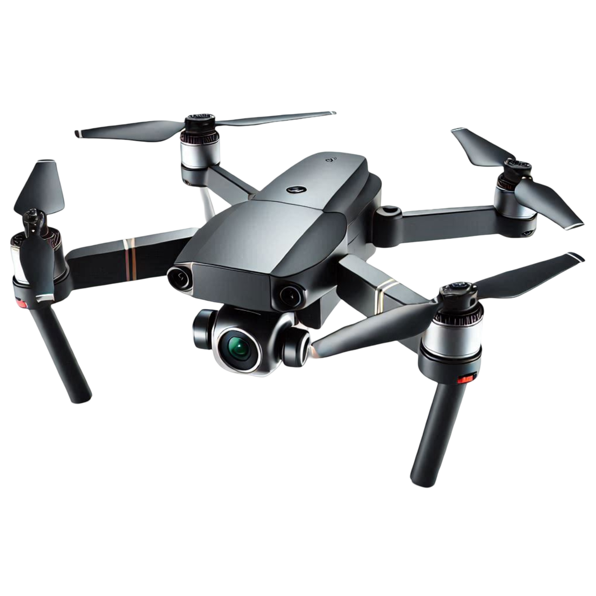

# Advanced Drone Detection System



An intelligent drone detection system developed using **Python, OpenCV, and YOLOv5** for real-time aerial object detection and monitoring. The system identifies drones from live video feeds, tracks their positions, and generates alerts when drones enter a predefined security zone.

## Project Overview

The Advanced Drone Detection System is designed to enhance surveillance and security by automatically detecting drones in real time. The project combines computer vision and deep learning techniques to identify drone activity and provide instant visual alerts.

This system can be applied in:

* Airport and aviation security
* Military and defense monitoring
* Border surveillance
* Industrial and restricted-area protection
* Smart city security systems

---

## Key Features

* Real-time drone detection using YOLOv5
* Live video stream processing with OpenCV
* Detection confidence display
* Interactive security boundary creation
* Automatic warning alerts for intrusions
* Adjustable detection area without modifying code
* Lightweight and easy-to-use implementation

---

## Technology Stack

* Python
* OpenCV
* YOLOv5
* NumPy
* Pandas
* Computer Vision
* Machine Learning

---

## Project Workflow

1. Capture live video feed from the camera.
2. Process frames using OpenCV.
3. Detect drones using the trained YOLOv5 model.
4. Draw bounding boxes around detected drones.
5. Calculate object position relative to the defined security zone.
6. Trigger alerts when drones enter or approach the protected area.

---

## Installation

### Clone the Repository

```bash
git clone https://github.com/shaikayan13/advanced-drone-detection.git
cd advanced-drone-detection
```

### Create Virtual Environment

```bash
python -m venv venv
```

### Activate Virtual Environment

Windows:

```bash
venv\Scripts\activate
```

### Install Dependencies

```bash
pip install -r requirements.txt
```

### Run the Application

```bash
python Advanced_Drone_Detection.py
```

---

## Usage

* Launch the application.
* The webcam feed will open automatically.
* Draw a security boundary using the mouse.
* Monitor detected drones in real time.
* Receive warning notifications when drones enter the protected region.
* Press **Q** to exit the application.

---

## Benefits

### Enhanced Security

Provides continuous drone monitoring for sensitive locations.

### Automated Surveillance

Reduces dependency on manual monitoring.

### Real-Time Alerts

Instant notification when suspicious aerial activity is detected.

### Flexible Monitoring Zones

Users can dynamically define surveillance boundaries.

### Scalable Solution

Can be extended for larger surveillance networks and smart security systems.

### Cost-Effective

Uses open-source technologies to minimize deployment costs.

---

## Future Enhancements

* Multi-drone tracking support
* Cloud-based monitoring dashboard
* Mobile application integration
* Drone classification and identification
* GPS-based alert system
* Advanced threat assessment module

---

## Project Structure

```text
advanced-drone-detection/
│
├── images/
├── models/
├── screenshots/
├── Advanced_Drone_Detection.py
├── requirements.txt
├── README.md
└── LICENSE
```

---

## Screenshots

## INTERFACE


## DRONE OUTSIZE ZONE


## DRONE DETECTED IN RESTRICTED ZONE


## Author

**Shaik Ayan**

GitHub: https://github.com/shaikayan13

Computer Science Engineering Student

---

## License

This project is intended for educational and research purposes.
